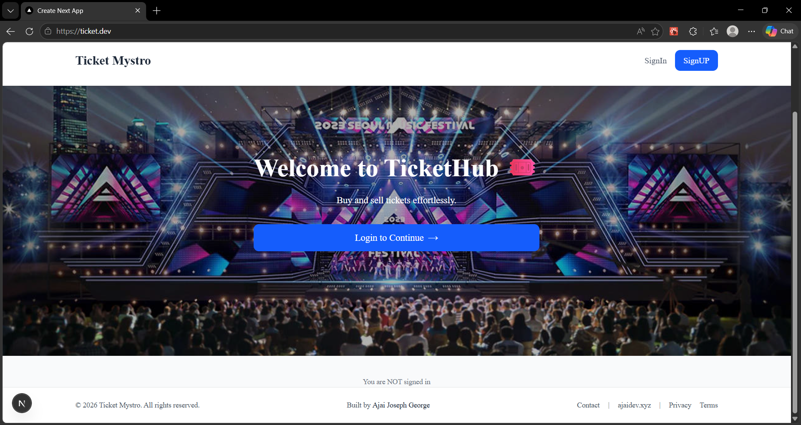

# 🚀 Microservices Monorepo

A production-style microservices architecture built using Node.js, React, Kubernetes, and event-driven communication.

---

## 🧠 Overview

This project demonstrates a scalable system design where multiple independent services work together to power a full-stack application.
---

## 🔗 Individual Repositories (original)

* Auth Service: <[link](https://github.com/ajai-motta/ticket-microservices-app)>
* Orders Service: <[link](https://github.com/ajai-motta/orders)>
* Payments Service: <[link](https://github.com/ajai-motta/payments)>
* Client Service: <[link](https://github.com/ajai-motta/ticket-microservices-client)>
* Expiration Service: <[link](https://github.com/ajai-motta/expiration)>
* Tickets Service: <[link](https://github.com/ajai-motta/tickets)>
---


---

## 🏗️ Architecture

* **Client App** → Handles UI and user interaction
* **Backend Services** → Independent microservices (Auth, Orders, Payments, expiration,tickets)
* **Event Bus** → Asynchronous communication between services
* **Infrastructure** → Kubernetes for orchestration

---

## 📁 Project Structure (for this repo)

```
monorepo/
│
├── apps/
│   └── client/            # Frontend (Next.js / React)
│
├── services/
│   ├── auth/              # Authentication service
│   ├── orders/            # Order management
│   ├── payments/          # Payment processing
│   ├── tickets/           # Ticket service
│
├── packages/
│   └── common/            # Shared logic (middlewares, utils)
│
├── infra/
│   └── k8s/               # Kubernetes configs
│
└── README.md
```

---

## ⚙️ Tech Stack

* **Frontend**: React / Next.js
* **Backend**: Node.js, Express
* **Database**: MongoDB
* **Messaging**: NATS (event-driven communication)
* **Caching / Queue**: Redis
* **Containerization**: Docker
* **Orchestration**: Kubernetes

---

##  How It Works

1. User interacts with the client app
2. Requests go through an ingress controller
3. Routed to appropriate microservice
4. Services communicate via events (NATS)
5. Data persisted in service-specific databases

---

## 🚀 Getting Started (on local)


### 1. Install dependencies (if using workspaces)

```
npm install
```

---

### 2. Run locally

Make sure you have:

* Docker installed
* Kubernetes cluster (local or cloud)
* Account in Razorpay

Apply infrastructure:

```
kubectl apply -f infra/k8s
```
```
kubectl apply -f infra/k8s-dev
```
```
kubectl create secret generic razor-secret --from-literal RAZOR_KEY=your_key
kubectl create secret generic jwt-secret --from-literal Jwt_key=1234
```
---

## 🌐 Services

| Service  | Description                 |
| -------- | --------------------------- |
| Auth     | Handles user authentication |
| Orders   | Manages orders lifecycle    |
| Payments | Handles transactions        |
| Tickets  | Manages ticket data         |
| Expiration  | Handles order expiration using background jobs/events |
---

## 📦 Shared Packages(@ajaisgtickets/common)

* Common error handling
* Middleware
* Event definitions

---

## ☁️ Deployment

* Kubernetes manages scaling and networking
* Ingress handles routing
* Each service runs in its own container

---

## 📌 Notes

* Each service is independently deployable
* Follows event-driven architecture
* Designed for scalability and fault isolation

---


## 👨‍💻 Author

Ajai Joseph

---

## ⭐️ Future Improvements

* Add more robust CI/CD pipeline
* Observability (logging + monitoring)
* Rate limiting & security enhancements
* Migrating to API Gateway 

---
### Some images

